# Sound Space

## Overview

Sound Space is a fictional music streaming platform which enables users to share their music with one another via their own profile. Users can follow each others profiles and engage with their content either by liking, commenting or reposting.

The target audience is wide as it encompasses music fans and artists/producers of any genre of music, essentially meaning anyone with a passion for music. The social media element to it will appeal more to younger demographics, however music fans of any age will find use from the site.

Due to time restraints and limited cloud storage the site does not give users the ability to upload their own audio files to the database, instead tracks are embedded using links from existing websites to represent this.

Live Link: https://soundspace-fe.herokuapp.com/

## Project Goals

The main goal for the project is to build a music sharing platform which allows users to discover new music and interact with other artists and fans. The main features include:

- Sign up/authentication capabitlities
- Functionality to follow/unfollow other users
- A profile page displaying all users tracks, liked & resposted tracks and information about themselves
- A track page allowing users to comment on one anothers tracks
- A home page displaying all tracks on the site
- A feed displaying tracks from users who have been followed by the logged in user
- Easy and clear site navigation
- Functionaility to update profiles, authentication details & tracks

## User Stories

The user stories were split into EPICS so that I could utilise GitHub projects and build the site with an agile approach (These can be viewed via the repository). These were as follows:

### User Authentication

- As a user I can sign up for an account so that I can access all features available on the site
- As a user I can log in to my account so that I can make use of all the features an authetnicated user possesess
- As a user I can log out of my account so that I can prevent other people accessing my account
- As a user I can stay logged in so that my user experience is not affected by having to continuously log back into my account whilst using the site

### User Profiles

- As a user I can view other users profiles so that I can decide whether I like their music/tracks and follow them
- As a logged in user I can follow/unfollow other users so that I decide the users/tracks appearing on my feed
- As a user I can see my own and other users followed/followers stats so that I can gauge fan base/following
- As a logged in user I can customise my profile so that I can keep it up to date with my current information
- As a logged in user I can update my username and/or password so that I can securely manage my account

### User Tracks

- As a user I can view individual tracks on their own page so that I can access all the feature available for a track
- As a logged in user I can edit/delete my posted tracks so that I have control of the tracks which I have posted
- As a logged in user I can post my own tracks so that I can share my music
- As a logged in user I can view, add, & delete comments via the individual track page so that I can communicate with other users

### Feed

- As a logged in user I can like or repost other users tracks from my feed so that I can save the track for later/support the artist
- As a user I can see the relevant tracks on my feed with newest tracks first so that the tracks I see are the most up to date
- As a user I can see all the tracks posted by other users I'm following on my feed so that I can follow their new music

### Site Navigation

- As a user I can search the site so that I can find the specific content I am looking for
- As a user I can intuitively navigate the site so that I can access all content and features

## Design

### Colour Scheme

The main colour scheme for the website is based on white & gray to keep things clean and simple. A teal colour was then used to accentuate other features/elements such as hovering over links, or the background colour for forms.

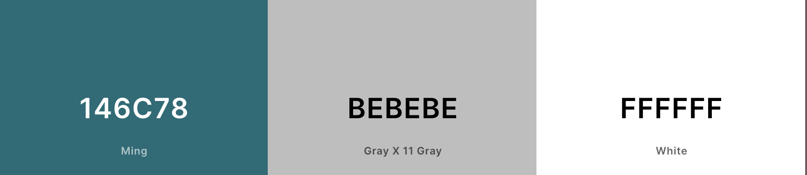

## Fonts

For the site I made use of just one font, Titillium Web, which was taken from google fonts. I felt this matched the simplistic clean look I was aiming for.

## Wireframes

The wireframes for the site were made from https://wireframe.cc/ and are attahced below:

- Desktop
    - [Homepage](src/assets/wireframes/desktopfeed.png)
    - [Blog post](src/assets/wireframes/desktopprofile.png)
    - [Mix page](src/assets/wireframes/desktoptrack.png)

- Tablet
    - [Homepage](src/assets/wireframes/tabletfeed.png)
    - [Blog post](src/assets/wireframes/tabletprofile.png)
    - [Mix page](src/assets/wireframes/tablettrack.png)

- Mobile
    - [Homepage](src/assets/wireframes/mobilefeed.png)
    - [Blog post](src/assets/wireframes/mobileprofile.png)
    - [Mix page](src/assets/wireframes/mobiletrack.png)

## Features

### Navigation Bar

- Displays the logo, which can be clicked to get back to the home page
- Displays naivgation links depending on users authentication status

(Meets authentication user story 1 - 3, tracks 3 & navigation 2)

### Search

- Filters search results and displays relevant tracks to the user

(Meets navigation user story 1)

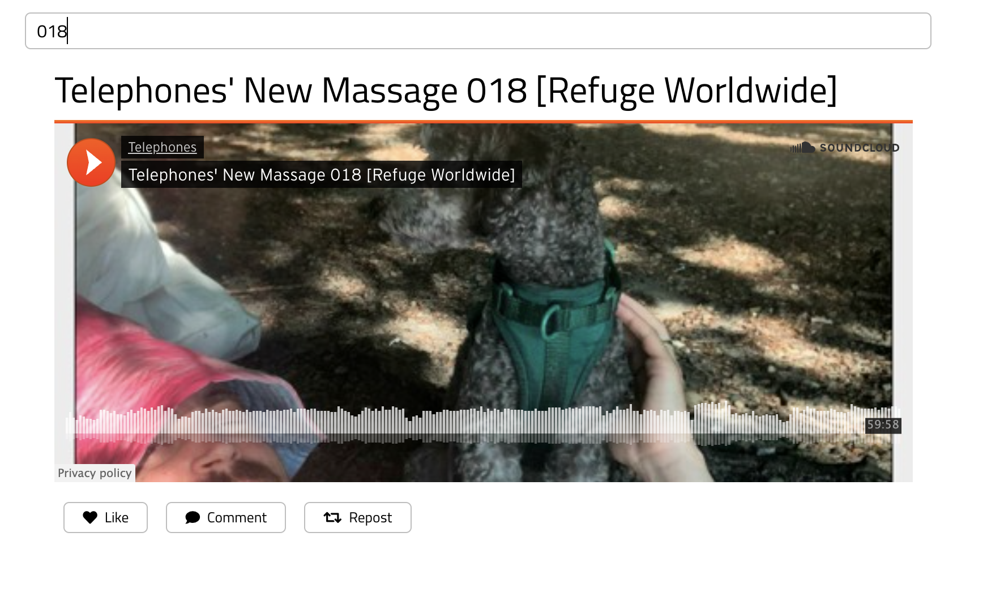

### Profile Suggest

- Displays other users on the home page/feed

(Meets profile user story 1 & 2)

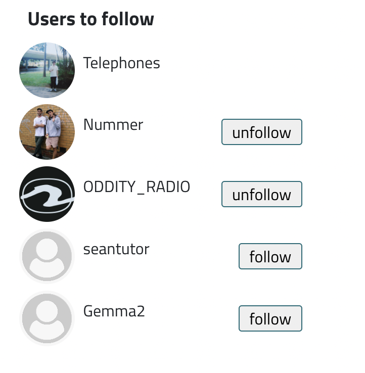

### User Profile

- Displays user image, bio, stats, liked tracks & reposts

(Meets profile user story 1 & 3, feed 1)

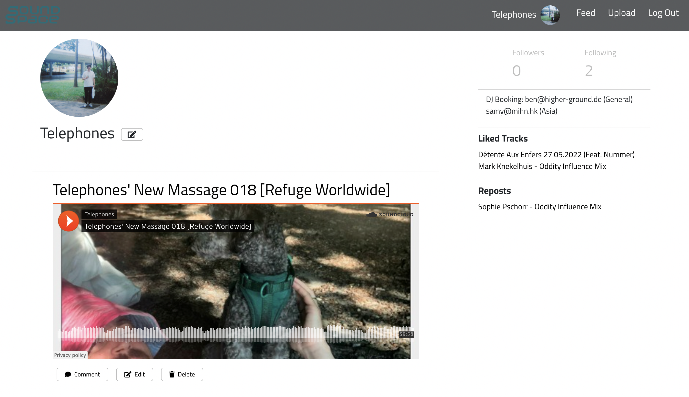

### Profile Edit

- Allows users to update their profile and also their log in details

(Meets profile user story 4 & 5)

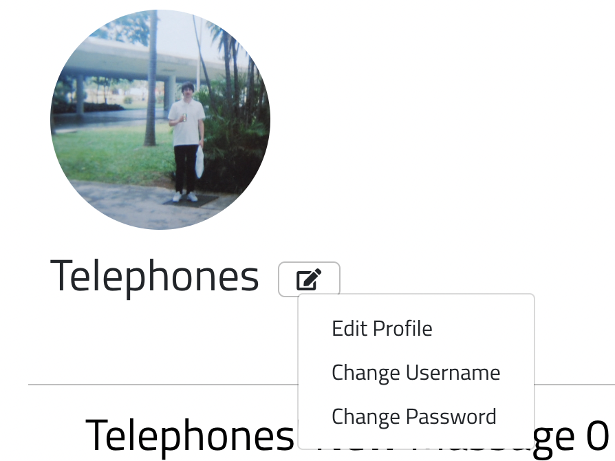
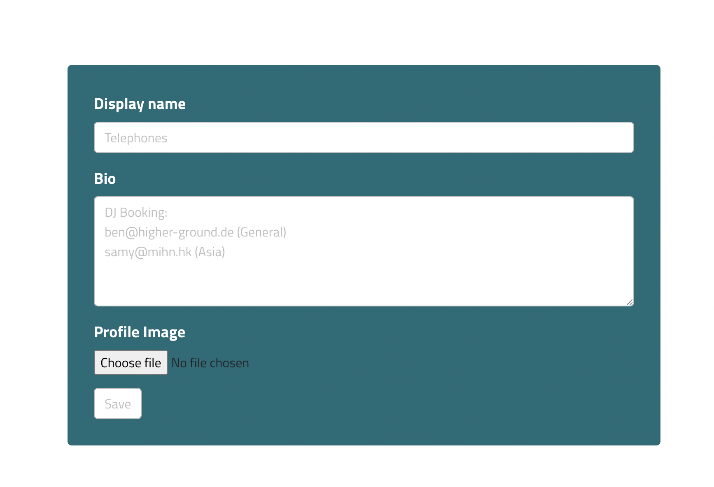
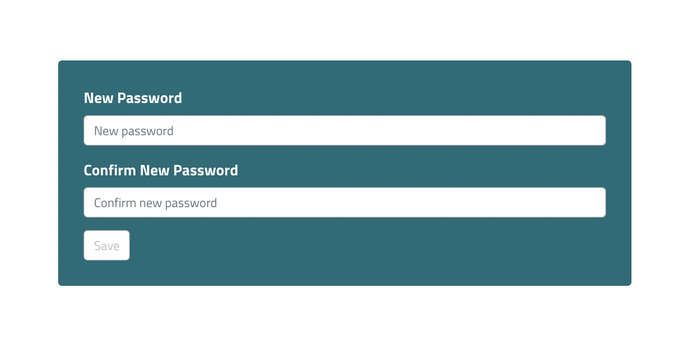
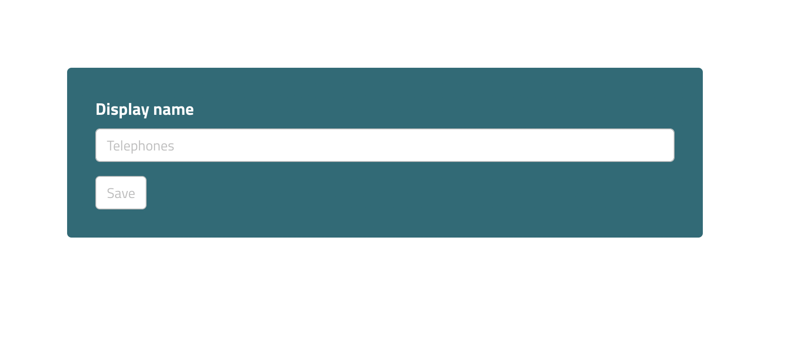

### Track Page

- Allows users to comment on one anothers tracks and interact with one another
- Allows users to update/delete their own tracks or like/repost other users tracks

(Meets tracks user story 1,2 & 4)

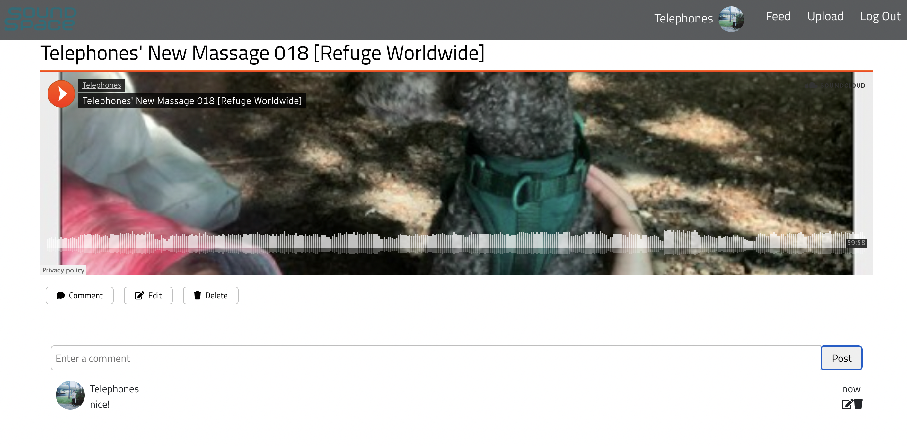

### Track Edit Form

- Allows users to update/delete their own tracks

(Meets tracks user story 2)

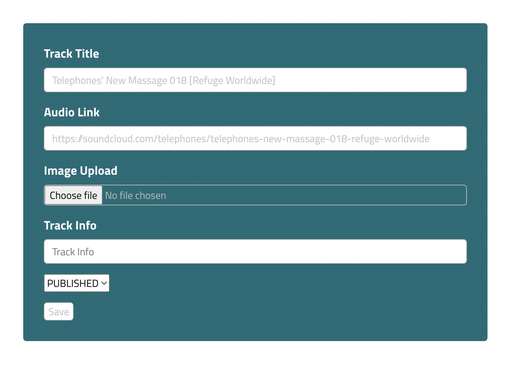

### Feed

- Allows users to see posts by all the users they are following and interact with them

(Meets feed users story 1-3)

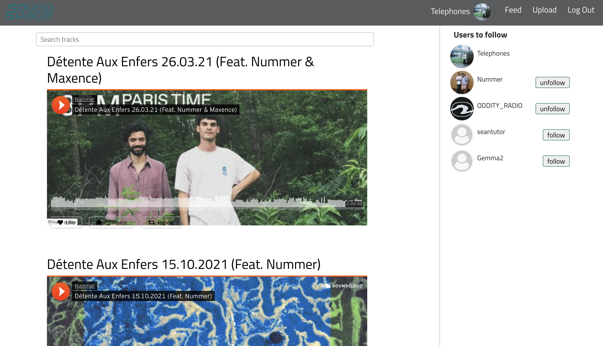

## Front End Development

Front end developers are responsible for handling the side of an applicaiton which users will be using. Front end developers will work as part of a development team with both UI/UX designers and the team handling the back end of an application. Their main objectives are to provide user friendly applications which meet performance, accessability & responsivity standards. Front end developers will still typically need a good understanding of all aspects of the project development in order to provide the best possible end product.

React enables front end developers to provide great user experience. One of they key features of react is the reuse of components across code. For example, in this project I make use of a loading component, which can then be imported into any other page and implemented. The same loading compent is displayed across the site whenever data is being retrieved from the API - this can be when tracks are loading in the feed/home page, when suggested profiles are loading, or while liked tracks/reposts are loading on the profile page. Another key feature of react is the virtual DOM. This allows components to re-render accordingly without the need to refresh the page - for example on this site when a user follows another user the follow button will render to say unfollow.

In the project I also made use of React Bootstrap. This front end end library again allows you to quickly and easily implement components like a repsonsive Navbar, or forms. Combined with the features of React these allow you to build cohesive rich user interfaces, which are hallmarks of good front end development and were why they were a good choice/combination for the project.

